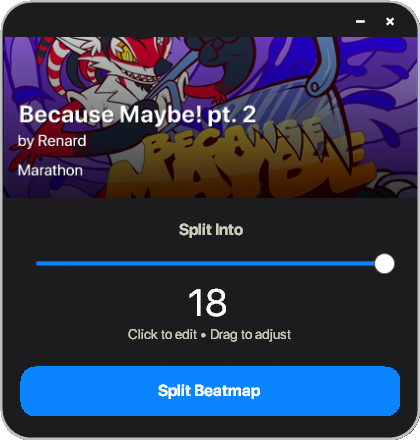

# osu-splitter

A small tool that lets you split osu! beatmaps into multiple parts for practice. It supports all osu! game modes: std, mania, ctb, and taiko.

## Download

https://github.com/cfxosu/osu-splitter/releases/tag/osu-splitter-1.0

## Additional Notes

The application reads beatmap data directly from osu!'s memory while the game is running, making it highly responsive and accurate. You can split beatmaps into 2–100 parts based on hit object count. The tool also supports automatic difficulty naming and creates .osz archives for easy import.

## Contact

- [Discord](https://discord.gg/bT7hySK2te)  
- [osu!](https://osu.ppy.sh/users/15903077)
- [YouTube](http://www.youtube.com/@cfxosu)

## Licenses

This project uses:

- [ProcessMemoryDataFinder](https://github.com/Piotrekol/ProcessMemoryDataFinder/tree/master)
- [GDI+ (built into .NET Framework)](https://learn.microsoft.com/en-us/windows/win32/gdiplus/) (built into Windows/.NET)
